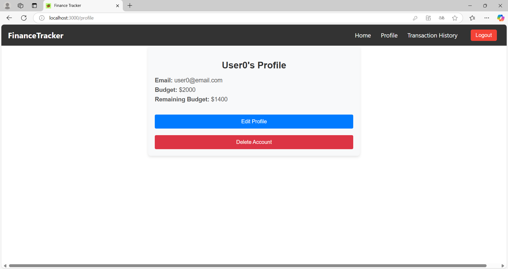

# Personal Finance Tracker

A sleek and intuitive Personal Finance Tracker app to help you manage your budget and expenses effortlessly. Built with React, this application allows you to visualize your spending patterns and remaining budget using interactive charts. Stay on top of your finances with real-time insights and customizable expense categories.

## Features

- **Budget Management**: Add and track your total budget.
- **Transaction Tracking**: Log and categorize your transactions (expenses and income).
- **Expense Overview**: Visualize your expenses in a pie chart.
- **Real-time Data**: See your remaining budget and total expenses updated in real time.
- **Responsive Design**: Fully functional on both desktop and mobile devices.

## Tech Stack

- **Frontend**: React, styled-components, Recharts
- **Backend**: Node.js, Express
- **Database**: MongoDB (or MySQL if you plan to use it for your project)
- **Authentication**: JWT tokens for secure user login

## Getting Started

To get a local copy of the project up and running, follow these simple steps.

### Prerequisites

You need `Node.js` and `npm` installed. If you don't have them, you can download and install them from [Node.js website](https://nodejs.org/).

### Installation

1. Clone the repository (remember to use the latest version from branch):
   ```bash
   git clone https://github.com/JAS-30/personal-finance-tracker.git

2. Navigate into the project directory:
   ```bash
   cd personal-finance-tracker

3. Install the dependencies for the frontend:
   ```bash
   cd frontend
   npm install

4. For the backend, install the dependencies:
   ```bash
   cd backend
   npm install
5. Set up MongoDB:  
Install MongoDB locally or use a cloud service like MongoDB Atlas.  
Create a .env file in the root of the backend project and add the MongoDB connection string (e.g., MONGO_URI=mongodb://localhost:27017/budgetTracker).
### Running the Application

1. Start the frontend:
   ```bash
   npm start

2. Start the Backend (if applicable)
   ```bash
   node src/app.js

The application should now be running.

### Usage

Once the app is running:

- Login or Register.
- Navigate to the homepage to add and view transactions.
- Use the transaction form to log your expenses and income.
- View your budget summary and track your spending in real-time.
- Use the pie chart to visualize your expense distribution.
- Modify your profile and explore your transaction history.

## Preview

### Gallery of Images
Here are some screenshots of the application:

|  |  |  |  |  |
|---------------------------------------------|---------------------------------------------|---------------------------------------------|---------------------------------------------|---------------------------------------------|
| **Register**                               | **Login**                        | **After Login**                        | **Setting Budget**                        | **First transaction**                               |

|  |  |  |  |  |
|---------------------------------------------|---------------------------------------------|---------------------------------------------|---------------------------------------------|----------------------------------------------|
| **Budget overview**                     | **Expense overview**                         | **Budget overview 2**                               | **Expense chart**                              | **Transaction history**                            |

|  |
|-----------------------------------------------|
| **Profile**                |


   
